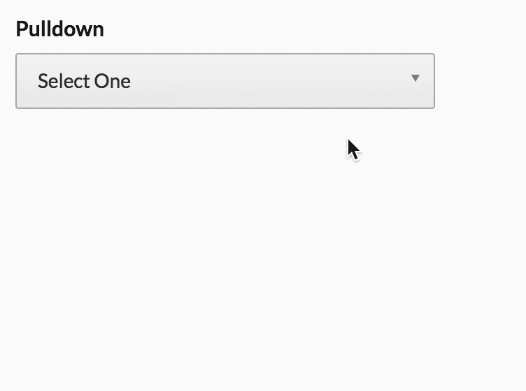
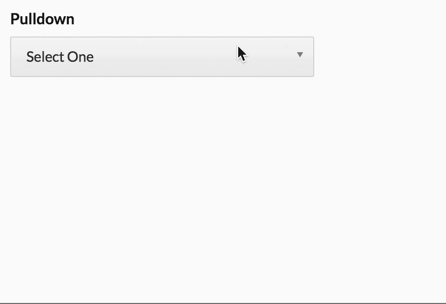
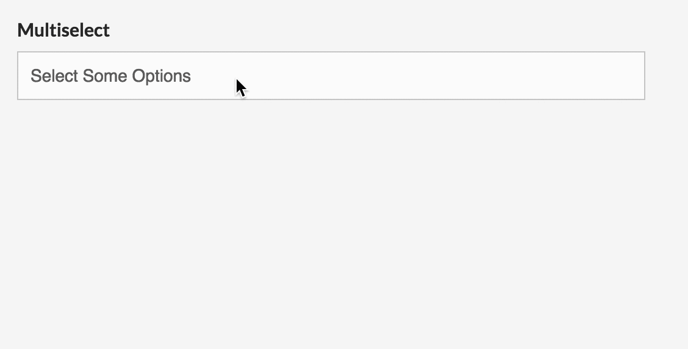
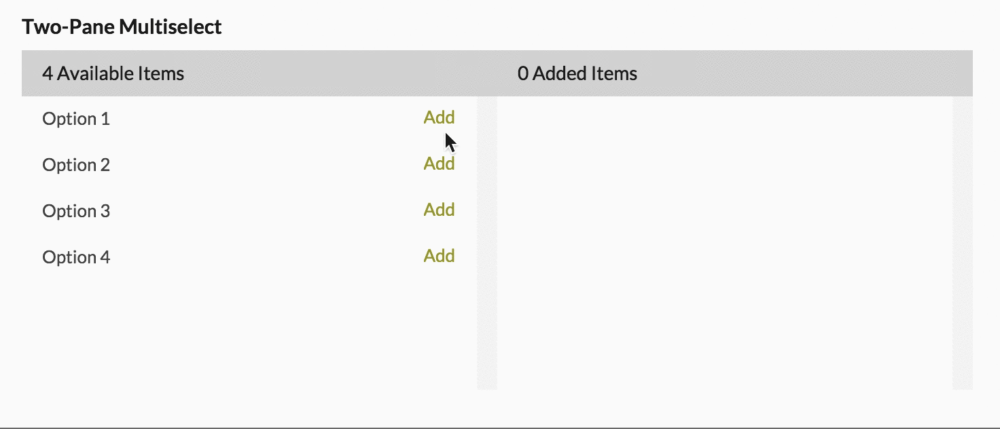
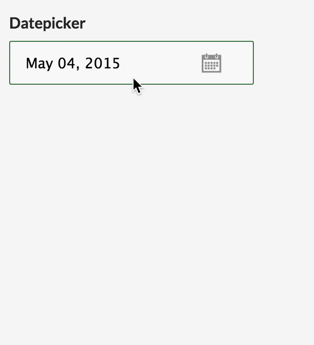
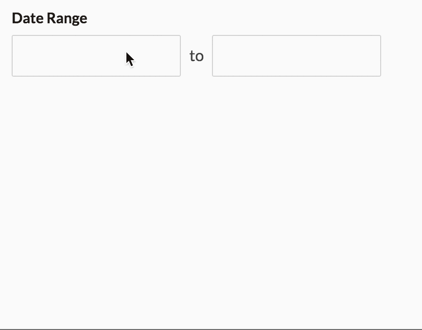
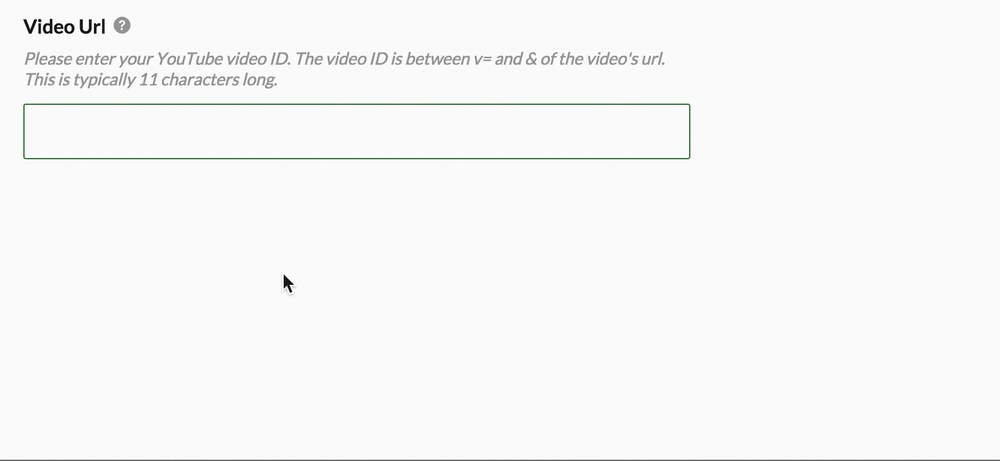
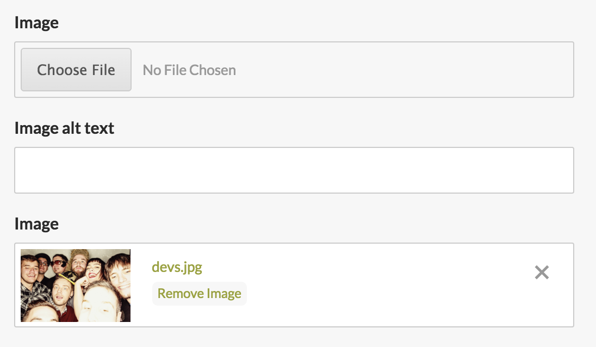
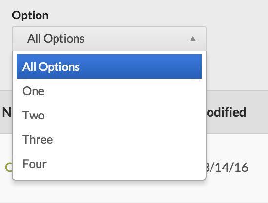
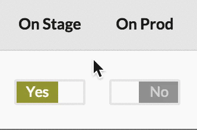

# Helpers

* [Form Helpers](#form-helpers)
* [Nested Form Helpers](#nested-form-helpers)
* [View Helpers](#view-helpers)
* [Fae Partials](#fae-partials)
* [Add-ons](#add-ons)

---

# Form Helpers

Form helpers in Fae use the [simple_form](https://github.com/plataformatec/simple_form) gem as it's base. In most cases options that simple_form accepts can be passed into these helpers directly. The reason why we've established these helpers it to allow for customized options. They also provide a method to directly hook into Fae, so we can push out features and bugfixes.

## Format

All form helpers are in the following format:

```ruby
fae_method_name(f, attribute, options)
```

| argument | description |
| -------- | ----------- |
| f | **(required)** The variable simple_form passes through in it's block. The actual variable can vary based on how you setup the view, but `f` is the generated default. |
| attribute | **(required)** The attribute the form element is displaying. It's recommended you use symbols over strings. |
| options | An optional hash of options to customize the form element. |

### Global Options

| option | type | default | description |
| ------ | ---- | ------- | ----------- |
| label | string | attribute.humanize | the form label |
| helper_text | string | | helper text that appears under label |
| hint | string | | text that appears in a hint modal |
| dark_hint | string | | **warning: this option will be depreciated in v2.0** text that appears in a dark color scheme (`hint` will override `dark_hint` if simultaneously supplied) |
| markdown | boolean | false | adds markdown GUI toolbar |
| markdown_supported | boolean | false | displays support text and hint for markdown |
| input_class | string | | a class to add to the input element |
| wrapper_class | string | | a class to add to the wrapper element |
| validate | boolean | true | triggers `judge` to validate element |

## fae_input

*attributes only*

fae_input is the basic input method derived from simple_form's f.input. What it displays will depend on the column type of the attribute. See [simple_form's documentationn](https://github.com/plataformatec/simple_form#available-input-types-and-defaults-for-each-column-type) to learn more.

**Examples**

An input[type=text] with an added wrapper_class and helper_text:
```ruby
fae_input f, :first_name, wrapper_class: 'special_wrapper', helper_text: 'No more than 50 characters'
```

A textarea with Fae's built-in markdown hint:
```ruby
fae_input f, :description, markdown_supported: true
```

## fae_association

*associations only*

fae_association is directly derived from simple_form's f.association. Again, the element it renders depends on the association type.

| option | type | default | description |
| ------ | ---- | ------- | ----------- |
| collection | array or AR:Relation | AssociationClass.all | an array or ActiveRecord object of items to populate the element |

**Examples**

A dropdown listing active people
```ruby
fae_association f, :people, collection: Person.active
```

## fae_checkbox


| option | type | default | description |
| ------ | ---- | ------- | ----------- |
| type | 'stacked' or 'inline' | stacked | determines how multiple checkboxes are displayed |

**Examples**

A single attribute checkbox
```ruby
fae_checkbox f, :active
```

Inline has_many collection of checkboxes
```ruby
fae_checkbox f, :promos, type: 'inline', collection: Promo.live
```

## fae_radio


| option | type | default | description |
| ------ | ---- | ------- | ----------- |
| type | 'stacked' or 'inline' | stacked | determines how multiple checkboxes are displayed |

**Examples**

A single attribute radio
```ruby
fae_radio f, :active, type: 'inline'
```

A belongs_to association
```ruby
fae_radio f, :wine
```

## fae_pulldown



| option | type | default | description |
| ------ | ---- | ------- | ----------- |
| collection | array or AR:Relation | AssociationClass.all | an array or ActiveRecord object of items to populate the element |
| size | 'long' or 'short' | long | determines the size of the pulldown |
| search | boolean | search is displayed with more than 10 items | determines whether or not to show the search bar |

**Examples**

A short pulldown of a belongs_to association
```ruby
fae_pulldown f, :wine, size: 'short', collection: Wine.order(:name)
```

With search:



## fae_multiselect



*associations only*

| option | type | default | description |
| ------ | ---- | ------- | ----------- |
| two_pane | boolean | false | By default this will display a chosen style multiselect, setting this to true will display the 'two pane' style. |

**Examples**

A chosen style multiselect with custom label_method
```ruby
fae_multiselect f, :acclaims, label_method: :publication
```

A two pane style multiselect
```ruby
fae_multiselect f, :selling_points, two_pane: true
```



## fae_grouped_select

| option | type | default | description |
| ------ | ---- | ------- | ----------- |
| collection | array or AR:Relation | AssociationClass.all | an array or ActiveRecord object of items to populate the element |
| groups | array of strings | | must be used with labels |
| labels | array of strings | | must be used with groups |

## fae_datepicker



*attributes only*

**Examples**

```ruby
fae_datepicker f, :release_date
```

## fae_daterangepicker



*attributes only*

The daterangepicker is a little different: instead of a single attribute, it accepts an array of two attributes.

**Examples**

```ruby
fae_daterange f, [:start_date, :end_date], label: 'Start/End dates'
```

## fae_prefix


*attributes only*

| option | type | default | description |
| ------ | ---- | ------- | ----------- |
| prefix | string | | **(required)** string to appear in prefix box |
| icon | boolean | false | determines whether or not to display prefix icon |

**Examples**

```ruby
fae_prefix f, :price, prefix: '$', placeholder: '50.00'
```

## fae_suffix


*attributes only*

| option | type | default | description |
| ------ | ---- | ------- | ----------- |
| suffix | string | | **(required)** string to appear in suffix box |
| icon | boolean | false | determines whether or not to display prefix icon |

**Examples**

```ruby
fae_suffix f, :weight, suffix: 'lbs'
```

## fae_video_url



*attributes only*

This helper is a normal fae_input, but provides a custom helper and hint specific to extracting YouTube IDs.

**Examples**

```ruby
fae_video_url f, :video_url
```

---

# Nested Form Helpers

## fae_image_form

 

*Fae::Image association only*

| option | type | default | description |
| ------ | ---- | ------- | ----------- |
| label         | string | image_name.to_s.humanize | the uploader's label |
| helper_text         | string | | the uploader's helper text|
| alt_label           | string | "#{image_label} alt text" | the alt field's label |
| alt_helper_text     | string | | the alt field's helper text |
| caption_label       | string | "#{image_label} caption" | the caption field's label |
| caption_helper_text | string | | the caption field's helper text |
| show_alt            | boolean | true | displays the alt field, label and helper text |
| show_caption        | boolean | false | displays the caption field, label and helper text |
| required            | boolean | false | adds required validation to the uploader |
| attached_as         | symbol | image_name.to_s | Sets the `attached_as` atrribute on upload. You'll need to customize this if your `attached_as` condition doesn't match the images associaiton name. |

**Examples**

```ruby
fae_image_form f, :logo, label: 'Corporate Logo', required: true
```

## fae_file_form


*Fae::File association only*

| option | type | default | description |
| ------ | ---- | ------- | ----------- |
| label         | string | file_name.to_s.humanize | the uploader's label |
| helper_text   | string | | the uploader's helper text|
| required      | boolean | false | adds required validation to the uploader |

image_label: nil, alt_label: nil, caption_label: nil, omit: nil, show_thumb: nil, required: nil, helper_text: nil, alt_helper_text: nil, caption_helper_text: nil


**Examples**

```ruby
fae_file_form f, :tasting_notes_pdf, helper_text: 'PDF format only'
```

## fae_content_form

*Fae::TextField and Fae::TextArea association only*

| option | type | default | description |
| ------ | ---- | ------- | ----------- |
| label         | string | attribute.to_s.titleize | the fields's label |
| helper_text   | string | | the field's helper text |
| hint          | string | | the field's hint text (supports HTML) |
| markdown      | boolean | false | adds markdown GUI toolbar |
| markdown_supported | boolean | false | displays support text and hint for markdown |
| input_options | hash with simple form options | false | adds simple form options to input field |

image_label: nil, alt_label: nil, caption_label: nil, omit: nil, show_thumb: nil, required: nil, helper_text: nil, alt_helper_text: nil, caption_helper_text: nil, wrapper_html: nil, input_options: nil

**Examples**

```ruby
fae_content_form f, :body, markdown: true
```

```ruby
fae_content_form f, :ad, input_options: { collection: ['Header', 'Footer'], input_html: { class: 'js-ad-field' }, wrapper_html { class: 'hidden' } }
```

## fae_filter_form


Displays the filter form, including the search field, submit and reset buttons. Accepts options and a block.

| option | type    | default                                | description |
|--------|---------|----------------------------------------|-------------|
| action | string  | "#{@index_path}/filter" | the path the form submits to |
| title  | string  | "Search #{@klass_humanized.pluralize.titleize}" | the h2 text in the filter form |
| search | boolean | true                                   | displays the search field |
| cookie_key | string | false | set your cookie name on the fae_filter_form if you want to persist selected filtered state |


**Examples**

```slim
== fae_filter_form title: 'Search some stuff', search: false do
  // form elements
```

## fae_filter_select(attribute, options)



Dislays a select tag to be used within a `fae_filter_form`.

| option       | type                    | default                        | description |
|--------------|-------------------------|--------------------------------|-------------|
| label        | string                  | attribute.to_s.titleize        | label on select |
| collection   | ActiveRecord collection | AttributeAsClass.for_fae_index | the collection of AR objects to populate the select options |
| label_method | symbol                  | :fae_display_field             | the attribute to use as the label in the select options |
| placeholder  | string or boolean       | "All #{options[:label]}"       | the blank value in the select, can be set to false to disable |
| options      | array                   | []                             | an alternative array of options if the options aren't an ActiveRecord collection |
| grouped_options | array                | []                             | an alternative array of grouped options if the options aren't an ActiveRecord collection |
| grouped_by   | symbol                  |                                | a Fae association on the models in `collection`. The association must have a `fae_display_name` method |

**Examples**

```slim
== fae_filter_form do
  == fae_filter_select :group, label: 'Groupings', collection: Groups.for_filters
  == fae_filter_select :group, label: 'Groupings', collection: Groups.for_filters, grouped_by: :filter
```

---

# View Helpers

## fae_date_format

The fae_date_format and fae_datetime_format helpers format a DateTime object in Fae's preferred method.
The default, fae_date_format, formats to 06/23/15.

```ruby
fae_date_format item.updated_at
```

## fae_datetime_format

You may also use fae_datetime_format for the long date format with time (Jun 23, 2015  4:56pm PDT).

```ruby
fae_datetime_format item.updated_at
```

## fae_toggle



The fae_toggle helper method takes an AR object and attribute. It then creates the HTML necessary for a working Fae on/off toggle switch.

```ruby
fae_toggle item, :on_prod
```

## fae_clone_button

You can use `fae_clone_button` in your list view tables to provide easy access to clone an item. Just pass in the item and the button will clone the object and take you to the newly created object's edit form.

```ruby
fae_clone_button item
```

## fae_delete_button

You can use `fae_delete_button` in your list view tables to provide easy access to delete an item.

```ruby
fae_delete_button item
```

## form_header

The form_header helper takes an AR object or string to render an `<h1>` based on the action. Can also display breadcrumb links.

| option | type | description |
|--------|------|-------------|
| header | ActiveRecord object | **(required)** passed to form_header helper method  |

**Examples**

```ruby
form_header @user
```
renders `Edit User` on the edit page

```ruby
form_header 'Release'
```
renders `New Release` on the new page

## require_locals

The require_locals method is intended to be used at the beginning of any partial that pulls in a local variable from the page that renders it. It takes a Array of strings containing the variables that are required and the local_assigns view helper method.

If one of the locals aren't set when the partial is called and error will be raised with an informative message.

```ruby
require_locals ['item', 'text'], local_assigns
```

## fae_avatar

Retrieve a user's Gravatar image URL based on their email.

| option | type | description |
|-|-|-|
| user | Fae::User | defaults to `current_user` |

```ruby
fae_avatar(current_user)
#=> 'https://secure.gravatar.com/....'
```

---

# Fae Partials

## index_header

Displays page title, add button and flash messages.

| option | type | default | description |
|-|-|-|-|
| nested | boolean | false | converts normal add button to nested add button
| title | string | @klass_humanized.pluralize.titleize | the page's H1 |
| new_button | boolean | true | displays the add button |
| button_text | string | "Add #{title.singularize}" | add button text |
| csv | boolean | false | adds export to csv button |
| breadcrumbs | boolean | true | display breadcrumb navigation before title |

**Examples**

Standard implementation
```ruby
render 'fae/shared/index_header'
```

Custom header
```ruby
render 'fae/shared/index_header', title: 'Something Entirely Different', new_button: false, csv: true
```

## form_header


Displays breadcrumb links and form title.

| option | type | description |
|--------|------|-------------|
| header | ActiveRecord object | **(required)** passed to form_header helper method  |
| save_button_text (`v1.3 <=`)   | string | 'Save' | save button text |
| cancel_button_text (`v1.3 <=`) | string | 'Cancel' | cancel button text  |
| 
| cloneable | boolean | false | includes Clone button |
| clone_button_text | string | 'Clone' | clone button text |
| subnav | Array<String> | [] | generates "jump to" anchor links for long forms |

If `subnav` is supplied, sections within the form must include IDs matching the [parameterized](http://api.rubyonrails.org/classes/ActiveSupport/Inflector.html#method-i-parameterize) items. Note that `parameterize` will use `_` as a separator. 

```slim
- subnav_array = ['SEO']
- subnav_array.concat ['Nested Image Gallery', 'Recent Changes'] if params[:action] == 'edit'
= render 'fae/shared/form_header', header: @klass_name, subnav: subnav_array

section.content#attributes
  ...
section.content#nested_image_gallery
  ...
section.content#recent_changes
  ...
```

**Examples**

Standard implementation
```ruby
render 'fae/shared/form_header', header: @item, subnav: ['SEO', 'Image Gallery', 'Recent Changes']
```

## form_buttons
**Warning**: This partial will be depreceated in v2.0. Use `fae/shared/form_header` instead.

Displays form's save and cancel buttons.

| option | type | default | description |
|--------|------|---------|-------------|
| save_button_text   | string | 'Save' | save button text  |
| cancel_button_text | string | 'Cancel' | cancel button text  |

**Examples**

Standard implementation
```ruby
render 'fae/shared/form_buttons'
```

With custom text
```ruby
render 'fae/shared/form_buttons', save_button_text: 'Yes!', cancel_button_text: 'Nope :('
```

## nested_table

The nested table works in tandem with a nested model, typically created by the nested scaffold generator, to display a nested ajax form for creating associated items in the edit form.

The nested_table should go after the main form ends and should only placed on the edit page (it requires the parent_item to be present to associate new items to).

| option | type | default | description |
|--------|------|---------|-------------|
| index | false | boolean | used for nested index forms |
| assoc   | symbol | | **(required)** the association's name, or the item's name if it's for the index  |
| parent_item | ActiveRecord object | | **(required)** the item the new objects will be associated to  |
| cols* | array of symbols, or array of symbols and hashes | [], [{}] | an array of attributes to display on the list view, associations will display the `fae_display_field` or a thumbnail if it's a `Fae::Image` |
| title | string | assoc.to_s.humanize | the H3 directly above the form |
| header | string | title | the section's header |
| add_button_text | string | "Add #{title.singularize}" | the add button's text |
| ordered | boolean | false | allows list view to be sortable, which is saved to a `position` atttribute |
| has_thumb | boolean | false | displays a thumbnail in the list view (only applicable to `Fae::Image`)
| edit_column | boolean | false | displays edit link
| assoc_name | string | assoc.to_s | the stringified association name, used in the paths, **only update if you know what you're doing** |
| helper_text | string | '' | the h6 directly above the nested table, and below the tite,used to provide the user with some helper_text to describe the context |

***Example**

* cols option now accepts hashes for custom titles, using attr: and title:
```ruby
cols: [{ attr: :name, title: 'What did you call me?' }, :image, :title]
```

You may also pass in custom columns, like an association's count by first defining a method on the model, then passing it in to the cols option.

**Example**
```ruby
def cat_size
  cats.size.to_s
end

cols: [{ attr: :cat_size, title: 'Kitten Count' }]
```

**Examples**

Full Slim implementation with section wrapper and edit page conditional
```slim
- if params[:action] == 'edit'
  section.content
    = render 'fae/shared/nested_table',
      assoc: :tasting_notes,
      parent_item: @item,
      cols: [:name, :author, :live],
      ordered: true
```

## recent_changes


Displays recent changes to an object as logged by [Fae's change tracker](usage.md#markdown-header-change-tracker) in a table. Columns include the change's user, type, updated attributes and datetime.

This partial is best placed at the bottom of the form and will automatically hide itself in create forms, where there wouldn't be changes to display.

**Examples**

Standard implementation
```ruby
= render 'fae/shared/recent_changes'
```

Optionally, you can add a link to it in the form nav:
```slim
= render 'fae/shared/form_header', ..., subnav: [...,  'Recent Changes']
```

---

# Add-ons

## Slug generation


Auto-generate a slug from a field. Only populates if the `slug` input is blank.

**Examples**

```slim
= fae_input f, :name, input_class: 'slugger'
= fae_input f, :slug, helper_text: 'Populated from name'
```
